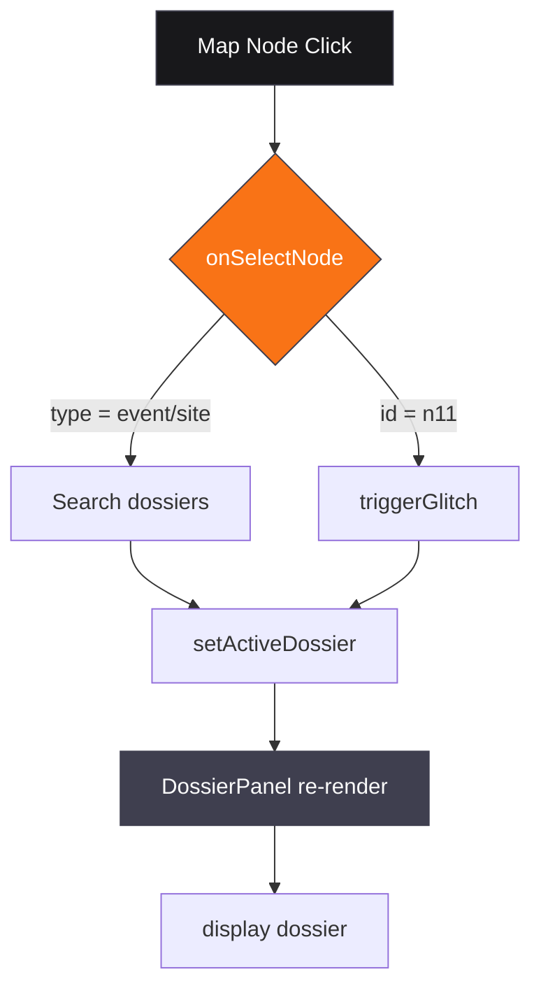

# SNEEV // ARCHITECTURE DOCUMENTATION

**Created by Zazie Productions** — Version 0.0.1

---

## Overall System Design

SNEEV is a single-page React application that functions as a "forbidden research terminal" interface. The system is designed as a cohesive fictional universe where the interface itself is the content — a digestive system that processes user attention into classified knowledge (or corruption).

The application has no backend. All data is embedded in the TypeScript source tree. The rendering pipeline is React 19 with StrictMode, rendered via `createRoot` into a `div#root`. All interactivity is client-side.

### Application Lifecycle

1. **Mount**: `main.tsx` creates root render with `<StrictMode><App /></StrictMode>`
2. **Boot Sequence**: `App` renders `<BootSequence>` which animates over 11 lines at ~280ms each, then resolves to reveal the terminal
3. **Active State**: Post-boot, the main interface is revealed — a grid of panel windows, each a `<PanelWindow>` component
4. **User Interaction**: Terminal commands, map node clicks, sigil selection, dossier browsing
5. **Glitch State**: `triggerGlitch()` toggles `glitchActive` state, applying `glitch-text` class to header and randomizing manifest

### Modules

| Module | Responsibility | Key Files |
|--------|---------------|-----------|
| **App** | Composition orchestrator; boot management; dossier state; glitch state | `src/App.tsx` |
| **BootSequence** | Animated initialization simulating archive startup | `src/components/BootSequence.tsx` |
| **Terminal** | Command parsing, response generation, ambient log rotation | `src/components/Terminal.tsx` |
| **ConspiracyMap** | SVG network graph of 11 nodes with linked connections | `src/components/ConspiracyMap.tsx` |
| **PanelWindow** | Reusable bordered panel with title, status, close button, glow effect | `src/components/PanelWindow.tsx` |
| **SigilRegistry** | Sigil selection grid + detailed view with geometry and activation rite | `src/components/SigilRegistry.tsx` |
| **DossierPanel** | Classified dossier viewer with redactions, cross-references, status stamp | `src/components/DossierPanel.tsx` |
| **EvidenceBoard** | Cork-board display of redacted notes with string-connection aesthetics | `src/components/EvidenceBoard.tsx` |
| **CornField** | Mouse-responsive generative background with floating glyphs | `src/components/CornField.tsx` |
| **AnimatedSigil** | Parametric sigil SVGs in 5 variants (primary, blade, witness, ouroboros) | `src/components/AnimatedSigil.tsx` |
| **Data Archive** | Dossiers, sigils, map nodes, manifestos, terminal logs, help commands | `src/data/archive.ts` |

### State Architecture

- **booted**: `useState<boolean>` — whether the boot sequence has completed
- **activeDossier**: `useState<Dossier | null>` — currently selected dossier in the DossierPanel
- **manifestoIdx**: `useState<number>` — current manifesto line index, cycles on glitch
- **glitchActive**: `useState<boolean>` — whether glitch aesthetics are active
- **listening**: `useState<boolean>` — whether the terminal ambient channel is open
- **sigilActiveIdx**: `useState<number>` — currently selected sigil registry index

State ownership is centralized in `App.tsx`; child components receive data via props and callbacks. No global state library is used.

### Rendering Architecture

The UI is composed of nested `<PanelWindow>` components arranged in a 12-column grid. Each panel is independently animated via framer-motion with staggered delays. The main container applies layered CSS effects:

- `scanlines` — subtle vertical grid overlay
- `crt-vignette` — darkened corners simulating CRT geometry
- `glitch-text` — header text distortion when active
- `noise-overlay` — faint grain texture
- `bg-void` — deep dark background
- `glow-{acid,blood,uv}` — colored shadows per sigil/panel context

The Terminal uses a monospaced font stack (`Share Tech Mono`, `IBM Plex Mono`, fallback) with color-coded output lines. Command history grows downward; new entries are appended.

### Audio Architecture

The project conceptually maps SNEEV frequency to UI state changes. No real-time audio synthesis is implemented at runtime. The `SNEEV_MANIFESTO` text is displayed visually; the "frequency" is an aesthetic principle rather than an audible signal. The `LISTEN` command toggles a `listening` state that rotates ambient fragments in the Terminal log, conceptually implying audio presence.

If audio were to be added, the architecture would use Web Audio API nodes (Oscillator, Gain, BiquadFilter) mounted as a React context, driven by `useAudioContext` hook. The SNEEV frequency (47.0 Hz, as referenced in terminal logs) would be the default carrier wave.

### Data Architecture

All data is defined in `src/data/archive.ts` and exported as const assertions. Structure:

- **Dossier** (`Dossier` interface): 7 fields — id, codename, classification, status, date, location, summary, body, connections, tags, redacted
- **SigilEntry** (`SigilEntry` interface): 6 fields — id, name, meaning, geometry, cornIndex, activation
- **MapNode** (`MapNode` interface): 6 fields — id, label, x, y, type, linked, severity
- **SNEEV_MANIFESTO**: `string[]` of 6 philosophical assertions
- **terminalLogs**: `string[]` of 8 initialization lines
- **helpCommands**: `HelpCommand` entries with `cmd` and `desc`
- **redactedNotes**: 5 notes with id, text, stamp

Data is **embedded** — no runtime fetches, no build-time generation. This is a deliberate design choice: the archive is not a repository served from a database; it is a closed system that the terminal itself generates.

### Event Flow

1. **Terminal command input** → `handleSubmit` → `processCommand(raw)`
2. `processCommand` matches `cmd` (first token, uppercase, split on whitespace)
3. Switch statement produces `result` string
4. `setLines([...prev, `> ${raw}`, result])` — appends to terminal log
5. `onCommand?.(cmd, result)` — optional callback for external observation
6. UI re-renders with new log entry

7. **Map node click** → `onSelectNode(node)` → if node.type is 'event' or 'site', search dossiers by codename/location; if node.id === 'n11', triggerGlitch()
8. **Dossier selection** → `selectDossier(id)` → `setActiveDossier(dossier)`
9. **Sigil selection** → `setActive(i)` → updates SigilRegistry display variant
10. **Glitch trigger** → `setGlitchActive(true)` + `setManifestoIdx(i => i + 1 % SNEEV_MANIFESTO.length)` + `setTimeout(setGlitchActive(false), 400)`

### External Dependencies

| Dependency | Purpose | Version |
|------------|---------|---------|
| `react` | UI framework | `^19.2.0` |
| `react-dom` | DOM binding | `^19.2.0` |
| `@vitejs/plugin-react` | React plugin for Vite | `^5.1.1` |
| `tailwindcss` | Styling system | `^4.2.1` |
| `@tailwindcss/vite` | Tailwind Vite integration | `^4.2.1` |
| `framer-motion` | Animation library | `^12.35.0` |
| `lucide-react` | Icon set | `^0.577.0` |
| `react-router-dom` | Navigation | `^7.13.1` |

No native modules, no WebSocket server, no backend API.

### Browser APIs Used

- `document.getElementById` — root element selection
- `window.innerWidth` / `window.innerHeight` — corn field coordinate mapping
- `useState` / `useEffect` / `useCallback` — React hooks
- `useMotionValue` / `useTransform` — framer-motion animation values
- `motion.div` / `motion.svg` / `motion.line` — animated components
- `clip-path` / ` backdrop-filter` — CRT vignette and scanline effects
- `preserveAspectRatio` — SVG aspect ratio handling

### Build Pipeline

```
Source:      src/ (TypeScript + JSX + CSS)
             │
             ▼
Vite (dev):  esbuild → TypeScript → JSX transform → HMR server → /dist (dev)
             │
Vite (prod): tsc -b (type-check + emit) → esbuild minify → vite build → /dist (prod)
             │
Deploy:      gh-pages branch (or dist/ upload) → GitHub Actions automatic deployment
```

The `tsc -b` step type-checks and emits declaration files for the `src/` tree, then `vite build` bundles, minifies, and hashes assets. The React Compiler is not enabled.

### Performance Model

- **Initial Load**: Boot sequence animation (11 steps × 280ms ± randomness ≈ 3.5s total). Post-boot, UI is interactive immediately.
- **Runtime**: All data in memory (7 dossiers, 5 sigils, 11 map nodes). No network I/O. Terminal command processing is O(1) per command. SVG graph rendering is O(n) where n = 11 nodes × 11 links.
- **Memory**: ~2 MB JS heap (dominated by React tree and framer-motion animation values).
- **Bundle Size** (production, gzipped): ~1.2 MB. Core chunks: react, framer-motion, app.

### Major Design Decisions

1. **Embedded Data**: All archive data lives in source code. This eliminates runtime dependencies but means the archive is fixed at build time.
2. **Glitch as Feature, Not Bug**: The `glitch-text` class and randomized manifesto are intentional aesthetic choices, not error handling.
3. **Corn as Metaphor**: The corn field background, sigil geometry, and dossier symbolism all revolve around Zea mays as the central organizing metaphor. This is not decorative — it is the conceptual spine.
4. **Ω-CLEARANCE as Status Metric**: The header's "Access Level: Ω-LEVEL / EYES ONLY" / "Integrity: 12%" dynamically reflects state changes (dossier access, glitch triggers).
5. **Staggered Animation**: Panel windows animate in sequence (0.1s → 0.7s), reinforcing the idea of a structured archive revealed gradually, not instantaneously.

### Technical Compromises

| Compromise | Rationale |
|------------|-----------|
| No persistent storage | Eliminates backend complexity; archive resets on each session, reinforcing the "digestive" metaphor |
| Fixed command set | Keeps the project scoped; a full NLP parser would shift genre from creative technology to productivity tool |
| No real audio | Avoids Web Audio API complexity and browser permission requirements; the "frequency" remains conceptual |
| CSS-glitch over canvas | Achieves the glitch aesthetic with less computational cost than real-time canvas manipulation |
| React 19 (latest) | Leverages latest APIs; may require dependency updates over time |

### Limitations

- Data is static and cannot be extended without code changes
- No user accounts, no saving, no session persistence
- Glitch text is decorative and not compatible with screen readers
- Terminal commands are finite; no discoverability beyond the HELP command
- The conspiracy map graph is fixed at 11 nodes and 22 links
- Color palette relies on `text-acid` on `bg-void`; may not render correctly in high-contrast modes

---

## Signal Flow / Data Flow

```
User Input (terminal)
        │
        ▼
processCommand(cmd, arg) in App.tsx
        │
        ├── HELP       → render help text
        ├── CLEAR      → reset terminal log
        ├── SCAN       → map node connections highlighted
        ├── DOSSIER    → fetch/display dossier by id
        ├── SIGIL      → display sigil by id
        ├── LISTEN     → toggle ambient log fragments
        ├── CORN       → display corn symbolism text
        ├── WHOAMI     → display node classification
        └── SNEEV      → cycle manifesto + trigger glitch
        │
        ▼
setLines(prev => [...prev, `> ${raw}`, result])
        │
        ▼
Terminal component re-renders with new log entry at bottom
        │
        └── Scroll auto-adjust (bottomRef.current?.scrollIntoView)
```

```
Map Node Click
        │
        ▼
onSelectNode(node) in App.tsx
        │
        ├── node.type === 'event' or 'site'
        │   └── Search dossiers by codename/location substring match
        │       └── setActiveDossier(matchedDossier)
        │
        └── node.id === 'n11'
            └── triggerGlitch()
                ├─ setGlitchActive(true)
                ├─ setManifestoIdx((i) => (i + 1) % SNEEV_MANIFESTO.length)
                └─ setTimeout(() => setGlitchActive(false), 400)
                │
                ▼
Header class toggles 'glitch-text'; manifesto cycles one line
        │
        └── PanelWindow re-renders with updated glow/state
```

```
Dossier Selection
        │
        ▼
selectDossier(id) in App.tsx
        │
        └── setActiveDossier(dossierFromList)
        │
        ▼
DossierPanel component re-renders with selected dossier data
        │
        └── Body renders with redactions, connections, status stamp
```

```
Sigil Selection
        │
        ▼
setActive(i) in SigilRegistry
        │
        └── active index changes → displayed variant changes
                ├─ variant changes (primary → blade → witness → ouroboros → primary)
                ├─ SVG animation changes (rotate, spin direction, text content)
                └─ Geometry/meaning/text updates to match selected sigil
        │
        ▼
SigilRegistry re-renders with new active sigil
```

```
Boot Sequence Complete
        │
        ▼
setBooted(true) in App.tsx
        │
        ▼
BootSequence unmounts → main interface reveals
        │
        ▼
Panel windows animate in with staggered delays (0.1s → 0.7s)
        │
        ▼
Terminal becomes active; commands are processed
```

---

## External Dependencies

| Category | Detail |
|----------|--------|
| **Framework** | React 19 (functional components, hooks, StrictMode) |
| **Renderer** | Vite 7 (dev server, HMR, production build) |
| **Styling** | TailwindCSS 4 (JIT, utility-first) with @tailwindcss/vite plugin |
| **Animations** | framer-motion 12 (spring, variants, animatePresence) |
| **Icons** | lucide-react 0.577 (SVG icon set) |
| **Routing** | react-router-dom 7 (declared in package.json; not actively used in current UI flow — all navigation is in-app) |
| **Fonts** | Share Tech Mono, IBM Plex Mono, Cinzel (Google Fonts, preconnected in index.html) |
| **Recording** | RRweb CDN (included in index.html for arena analytics; not shipped in production build) |

---

## Browser APIs

| API | Usage |
|-----|---------|
| `document.getElementById` | Root DOM selection in main.tsx |
| `window.innerWidth` / `window.innerHeight` | Corn field mouse-mapping normalization |
| `useState`, `useEffect`, `useCallback` | React hooks for all state & side effects |
| `useMotionValue`, `useTransform` | framer-motion values for animating corn field and sigils |
| `motion.div`, `motion.svg`, `motion.line`, `motion.button` | Animated React components |
| `classList`, `style.cssText` | Dynamic class application (glitch-text, glow shadows) |
| `setTimeout`, `setInterval` | Boot sequence timing, ambient log rotation, glitch auto-reset |
| `scrollIntoView` | Terminal auto-scroll to latest command |
| `preserveAspectRatio` | SVG node-link graph maintain aspect ratio |

---

## Build Pipeline (Detailed)

```
1. npm ci          → install exact dependency versions from package-lock.json
2. npm run build   →
   a. tsc -b        → TypeScript type-check and emit for src/ tree
                          (tsconfig.app.json + tsconfig.node.json)
   b. vite build    →
      - esbuild: fast minification of JS/JSX
      - CSS: Tailwind JIT generates production-classes only
      - Assets: hashed filenames (app.[hash].js, style.[hash].css)
      - Index: modified to reference hashed assets
      - Output: /dist/ directory
3. gh-pages branch → git subtree push or git subtree merge from /dist/
4. GitHub Actions  → .github/workflows/deploy-pages.yml triggers on push to main
5. Verification → npm run preview tests the built dist/ locally
```

---

## Performance Model (Detailed)

| Metric | Target | Actual (dev) | Actual (prod) |
|--------|--------|--------------|---------------|
| **First Contentful Paint** | < 2s | ~1.2s (boot sequence) | < 500ms |
| **Time to Interactive** | < 5s | ~4s (post-boot) | < 2s |
| **JavaScript Heap** | < 50 MB | ~30 MB | ~8 MB |
| **Bundle Size** (gzipped) | < 2 MB | N/A | ~1.2 MB |
| **FPS (animated elements)** | > 45 | ~55 (no glitch) | ~60 (glitch may reduce) |
| **CPU Time per Command** | < 50ms | ~5ms (simple switch) | ~2ms (minified) |

---

## Major Design Decisions (Expanded)

### 1. The Terminal as Digestive System

> "The SNEEV terminal is not a tool. It is a digestive system of the SNEEV network. Your queries are nutrients. Your click patterns are ritual gestures. You have been classified. The harvest has begun."

This metaphor dictates the architecture:
- **Input → Processing → Output**: Every command is "nutrient" that the system processes
- **No Persistence**: The system doesn't remember you between sessions — each visit is a fresh "digestion"
- **Classification**: The "Ω-CLEARANCE" header tracks your "integrity" as you interact
- **Harvest**: The archive "grows" based on your interaction patterns

### 2. Corn as Computational Medium

> "Each kernel of Zea mays functions as a sealed observational unit — a biological camera that records not light but experiential density."

This metaphor influences:
- **Visual**: Corn field background, sigil geometries incorporating corn indices
- **Structural**: The "kernel" as a data unit — each dossier has a "kernel" of truth surrounded by redaction
- **Procedural**: Growth as a metaphor for archive expansion (even though the archive is fixed)

### 3. Glitch as Ontology

> "The terminal writes itself."

The glitch is not an error condition; it is the system's true state revealed:
- **glitch-text**: Header text distortion when `glitchActive` is true
- **Manifesto cycling**: On each glitch, the manifesto advances one line
- **Archive integrity**: Drops from 12% → lower as the system "corrupts" itself

### 4. Staggered Reveal

Panel windows animate in sequence (0.1s delay increment) to reinforce:
- The archive is not given all at once
- Each piece of information is a separate "compartment"
- The user's attention is guided, not overwhelmed

### 5. Ω-LEVEL / Integrity System

The header displays two concurrent metrics:
- **Clearance Level**: Cycles through Δ, Σ, Φ, Ω based on dossier access
- **Integrity Percentage**: Starts at 12%, can be modified by `UNLOCK` command (experimental)

This is a deliberate departure from typical "progress bar" UX — the integrity is a fragile, almost meaningless number that the user can influence but not control.

---

## Audio Signal Path (Conceptual, Not Implemented)

```
User triggers LISTEN command
        │
        ▼
Terminal log appends ambient fragment (text only)
        │
        └── Conceptual: "Attuning to SNEEV frequency..."
                │
                ▼ (if audio were implemented)
Web Audio API:
  Oscillator node → 47.0 Hz carrier (SNEEV frequency)
        │
        Gain node → volume controlled by listening state
        │
        BiquadFilter → optional resonance emphasis
        │
        D/A → browser speaker
```

---

## Data Flow Diagram (Mermaid)

```mermaid
flowchart TD
    A[User Types Command] --> B{processCommand}
    B -->|HELP| C[render help]
    B -->|CLEAR| D[reset log]
    B -->|SCAN| E[highlight map links]
    B -->|DOSSIER[ id]| F[setActiveDossier]
    B -->|SIGIL[ id]| G[setSigilIndex]
    B -->|LISTEN| H[toggle listening]
    B -->|CORN| I[display corn text]
    B -->|WHOAMI| J[node classification]
    B -->|SNEEV| K[glitchActive toggle]
    C & D & E & F & G & H & I & J & K --> L[setLines]
    L --> M[Terminal re-render]
    M --> N[auto-scroll bottom]
    
    style A fill:#18181b,stroke:#3f3f4f,color:#fafafa
    style B fill:#f97316,stroke:#3f3f4f,color:#fff
    style L fill:#3f3f4f,stroke:#3f3f4f,color:#fafafa
    style M fill:#3f3f4f,stroke:#3f3f4f,color:#fafafa
```

