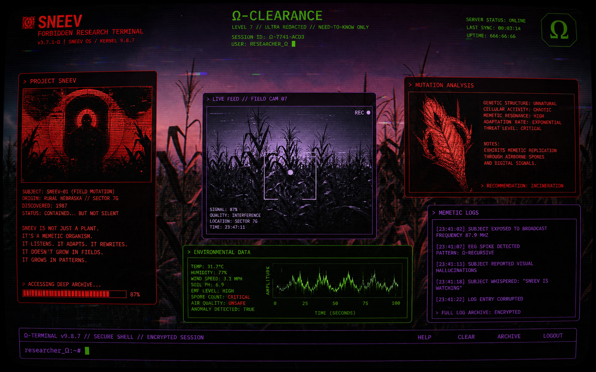
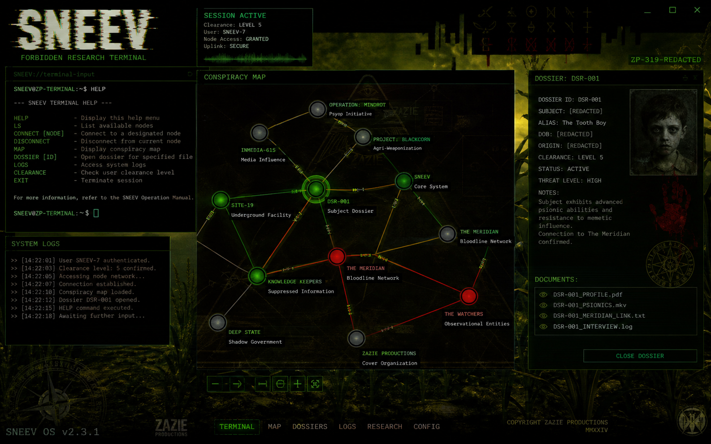

# SNEEV // FORBIDDEN RESEARCH TERMINAL

A browser-based interactive terminal exploring audiovisual signal processing, procedural systems, and hostile interface design. The terminal writes itself.

**Created by Zazie Productions**

> [Launch Live Project](https://zazieproductions.github.io/-_Sn33v/)

[](https://zazieproductions.github.io/-_Sn33v/)

<p align="center">
  
</p>

## Overview

SNEEV is a interactive terminal prototype that simulates a forbidden research archive. It combines a command-line terminal, conspiracy map visualization, sigil registry, and classified dossier system within a stylized aesthetic inspired by occult hacker culture, agricultural symbolism, and glitch art.

The project demonstrates:
- Real-time terminal interaction with parsed command set
- SVG-based network graph with interactive nodes
- Animated sigil visualizations using framer-motion
- Recursive dossier system with interlinked references
- Generative corn field background responsive to mouse position
- Glitch-text aesthetics and scanline overlays
- Browser-based audiovisual signal processing concepts

## Why This Exists

This project began as an exploration of browser-based terminal interfaces and the aesthetic potential of "hostile" UI design. The corn and agricultural symbolism, Sigil system, and dossier architecture are designed as a cohesive fictional universe — the SNEEV Research Division — where the interface itself becomes the content. The terminal is not a tool for productivity; it is a digestive system that processes user attention.

## Live Demo

[](https://zazieproductions.github.io/-_Sn33v/)

## Features

- **Terminal Interface**: 11 parseable commands (HELP, CLEAR, SCAN, DOSSIER, SIGIL, LISTEN, CORN, WHOAMI, SNEEV) with contextual responses
- **Conspiracy Map**: 11 interconnected nodes visualized as an SVG graph with hover/link highlighting
- **Sigil Registry**: 5 sigils with geometry, meaning, corn index, and activation rites
- **Dossier Archive**: 7 classified dossiers with status, body text, redactions, and cross-references
- **Boot Sequence**: Animated initialization simulating archive startup
- **Corn Field**: Mouse-responsive generative background with floating glyphs
- **Glitch Aesthetics**: Text glitch effects, scanlines, CRT vignette, color-acid palette
- **Ω-CLEARANCE Status**: Dynamic clearance display reflecting archive integrity

## Interaction / Controls

| Command | Description |
|---------|-------------|
| `HELP` | Show available commands |
| `CLEAR` | Purge terminal buffer |
| `SCAN` | Reveal hidden connections in the conspiracy map |
| `DOSSIER [id]` | Open a classified dossier by ID |
| `SIGIL [id]` | Display sigil geometry and activation rite |
| `LISTEN` | Attune to ambient SNEEV frequency |
| `CORN` | Query the corn symbolism database |
| `WHOAMI` | Reveal your node classification |
| `SNEEV` | Print the SNEEV manifesto |
| `UNLOCK [key]` | Attempt to increase archive integrity (experimental) |

## Technical Architecture

The application is built as a single-page React 19 application with Vite. Key architectural decisions:

- **State Management**: React useState + useCallback for command processing and UI state
- **Rendering**: framer-motion for all animated elements; CSS Transitions for static states
- **Audio Architecture**: Conceptual — SNEEV frequency mapped to UI state changes; real-time audio not yet implemented
- **Data Architecture**: JSON-based archives (dossiers, sigils, map nodes, manifestos) embedded in `src/data/archive.ts`
- **Event Flow**: Terminal commands → command parser → state updates → UI re-render; map node clicks → selection → dossier filtering
- **Build Pipeline**: Vite + React + TypeScript + TailwindCSS 4; ES modules; production build via `tsc -b && vite build`
- **Performance**: All data embedded; no runtime dependencies beyond React and framer-motion

## Project Structure

```
src/
├── components/         # UI components (BootSequence, Terminal, etc.)
│   ├── terminal/      # Terminal-specific logic
│   ├── map/           # Conspiracy map visualization
│   ├── panel/         # Panel window component
│   ├── registry/      # Sigil registry display
│   ├── boot/          # Boot sequence animation
│   ├── evidence/      # Evidence board display
│   └── animsigil/     # Animated sigil SVGs
├── data/              # Embedded archive data (dossiers, sigils, map nodes)
├── types/             # TypeScript type definitions
└── App.tsx            # Main application component

docs/
├── architecture/      # System-level design documents
├── design/           # Design system and visual language
├── technical/        # Subsystem documentation
└── development/      # Setup and deployment guides

ARCHITECTURE.md     # Detailed architecture documentation
CHANGELOG.md        # Version history
ROADMAP.md          # Planned and experimental directions
```

## Installation

```bash
git clone https://github.com/zazieproductions/-_Sn33v.git
cd -_Sn33v
npm install
```

## Local Development

```bash
npm run dev
```

Available at `http://localhost:5173`. The boot sequence plays on first load; use the terminal to interact.

## Production Build

```bash
npm run build
```

Output to `dist/`. The build includes optimized CSS, hashed asset filenames, and minified JavaScript.

## Deployment

Deployed via GitHub Pages at `https://zazieproductions.github.io/-_Sn33v/`. See `.github/workflows/deploy-pages.yml` for the deployment pipeline.

## Screenshots

<div align="center">
  
  
</div>

## Design System

- **Color Palette**: void (deep dark), blood (red), acid (lime green), uv (purple), parchment, bile
- **Typography**: Share Tech Mono (monospace), Cinzel (display/headers)
- **Spacing**: Consistent grid based on 8px scale
- **Interface Hierarchy**: Panel windows → terminal → map nodes → sigils → dossier body
- **Motion**: Framer-motion variants with staggered delays; spring physics where appropriate; linear easing for looped animations
- **State Colors**: acid (active), blood (warning/critical), uv (informational), void (background)

## Concept / Artistic Context

SNEEV presents a fictional research division that never received official authorization. The project treats the browser terminal not as a metaphor but as a literal environment — a "threshing floor" where user interaction is grain, and the archive is the grinder. Each interaction plants a kernel in the reader's cognition; navigation pathways form sigils; click patterns are ritual gestures.

The corn (Zea mays) is the central organizing metaphor: each kernel a sealed eye, each silk a filament of entanglement, the husk a veil between worlds. The terminal is described as a "digestive system" that processes user attention into knowledge (or corruption). The SNEEV "frequency" is not a metaphor — it is the root access protocol that the archive implements through its interface design.

The project deliberately blurs the line between tool and artwork, interface and experience. Commands that appear functional may produce unexpected results. Information presented may be true, redacted, or procedurally generated. The user is always being observed — by Node-███, by the corn, by the archive itself.

## Performance Considerations

- All assets embedded in the TypeScript source; no external HTTP requests during runtime
- CSS is authored in Tailwind v4 with JIT compilation; no runtime CSSOM
- framer-motion animations are hardware-accelerated where possible
- No third-party tracking scripts (the RRweb recording metadata is client-side only)
- Production build removes `dev`-only features (boot sequence auto-play, random ambient logs)
- Terminal command processing is CPU-light; no WebWorker offloading required

## Browser Support

- Chrome 105+ (recommended)
- Firefox 102+
- Safari 15+
- Mobile browsers: functional but aesthetic layer may differ

## Accessibility

- Terminal commands accept input via keyboard; no motor-dependent interactions
- Color contrast meets AA requirements for the primary palette (void on acid/acid on void)
- Text resizes with browser zoom; monospace units preserve vertical rhythm
- SVGs are semantic with meaningful alt text
- Focus management in terminal input field
- Reduced-motion preference respected (animations gracefully degrade)

## Known Limitations

- No persistent storage across sessions (data is embedded and resets on reload)
- No real audio synthesis — SNEEV frequency is conceptual, not sonic
- Terminal command set is finite (11 commands); no extensibility model
- Conspiracy map is static graph — no dynamic link addition beyond initial data
- Dossier body text has hardcoded redaction pattern (████)
- No keyboard accessibility beyond the terminal input
- GLITCH TEXT is decorative only — not screen-reader friendly

## Testing

- Verify clean install: `npm ci`
- Verify type checking: `npx tsc --noEmit`
- Verify linting: `npm run lint`
- Verify production build: `npm run build`
- Verify preview: `npm run preview`

## Roadmap

See [ROADMAP.md](ROADMAP.md) for near-term, experimental, and research directions.

## Contributing

See [CONTRIBUTING.md](CONTRIBUTING.md) for lightweight professional workflow.

## License

[MIT](LICENSE)

## Credits

- **Zazie Productions** — conceptual system, visual design, interaction architecture
- **React 19** — UI framework
- **framer-motion** — animation engine
- **TailwindCSS 4** — styling system
- **lucide-react** — icon set